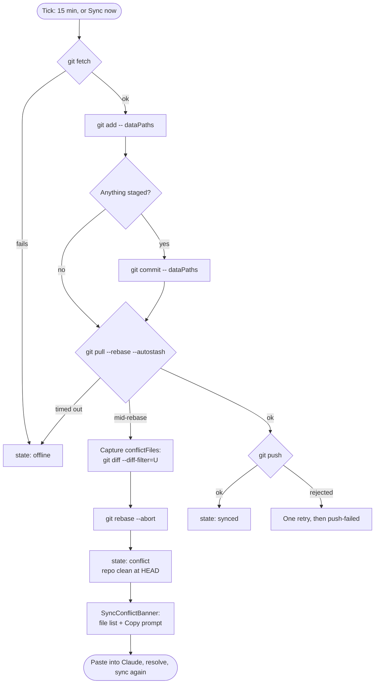

# Auto-sync UX: one sync control, 15-minute ticks, agent-resolvable conflicts

## Why

On 2026-07-28 the workspace repo (`gmotyl/projects`) sat diverged 9↔11 commits between
two machines for over a day. Eleven conflicts, every one of them under `panel/`,
`.opencode/` and `opencode.json` — `scripts/update.sh` output, tracked in the repo and
committed independently on each host via the `/git` page's manual commit block.

`syncRepo` handled it correctly and uselessly: `pull --rebase --autostash` hit the
conflict, `rebase --abort`ed, set `state: "conflict"`, and never pushed. Every
subsequent tick repeated that. The panel's only advice was "resolve in a terminal",
so the repo stayed stuck until someone diagnosed it by hand.

Three separate weaknesses, addressed here:

1. **Latency** — 30-minute ticks are long enough for both hosts to accumulate
   divergent work between syncs.
2. **Two doors, one of them a trap** — the `/git` page offered a "Pull" button (which
   actually pulls *and* pushes) next to a manual Stage/Commit block that will happily
   commit generated code. The trap is more prominent than the safe path.
3. **A dead end on conflict** — the failure state named no files and offered no route
   out, despite the resolution being mechanical.

Out of scope: a host guard in `update.sh` (only the mac runs it, by convention), and
any change to `dataPaths` semantics.

## Sync flow



The only new edge is `Capture` — the conflicted paths are read *before* the abort,
because after it they no longer exist. Everything else is today's behaviour.

## Changes

### 1. Interval: 30 → 15 minutes

`panel.config.ts` default `autoSync.intervalMinutes`, plus the hardcoded fallbacks
that shadow it when `autoSync` is absent: `server/index.ts` (`?? { intervalMinutes: 30 }`)
and `AutoSyncModal`'s display (`?? 30`).

### 2. One sync control on `/git`

`GitPanel` currently owns private `pulling` / `pullMsg` state and posts to
`/api/git/pull`. It becomes a consumer of `useAutoSyncStatus` — the same hook the
sidebar uses — so the control reflects **background ticks as well as clicks**. Today a
tick can fail while the `/git` page shows nothing.

- Circle-arrow (`RefreshCw`), spinning while `state === "syncing"`, tinted
  `var(--red)` on `conflict` / `push-failed`.
- Click calls `syncNow()`.
- Status line beneath: `synced · 11:36 · ↑2 ↓1`, or the `detail` string on failure.

**`POST /api/git/pull` is deleted.** It duplicates `/api/auto-sync/now` — same
`syncRepo` call — differing only in a `repo` parameter no caller passes, and
`GitPanel` was its only consumer. Two endpoints that must stay behaviourally
identical forever is a maintenance liability with no upside.

`GitChanges` gains `advancedCommit?: boolean` (default `false`). When set, the
Stage/Commit/Commit & Push block renders inside a `▸ Advanced: stage & commit`
disclosure, closed by default. `GitPanel` passes it; project views don't, so their
inline commit UI is untouched. The manual path stays reachable — just no longer the
most obvious button on the page.

### 3. Conflicts carry their own fix

**`SyncStatus.conflictFiles: string[]`** — populated only in the conflict branch,
cleared on every other outcome, and carried by the existing `sync-status` broadcast
plus both status endpoints.

**`autoSync.generatedPaths`** — new config array, default:

```
panel/  skills/  scripts/  commands/  .opencode/  .claude/commands/  opencode.json
```

Used *only* to classify conflicts for the prompt. It does not affect what gets
committed; that remains `dataPaths`.

**`buildConflictPrompt(input): string`** — a pure function, no React, no I/O:

```ts
interface ConflictPromptInput {
  repoRoot: string;
  branch: string;
  conflictFiles: string[];
  dataPaths: string[];
  generatedPaths: string[];
}
```

It partitions `conflictFiles` and emits a prompt encoding the resolution that actually
worked, per class:

- **Generated paths** — resolve *wholesale from one host's tree*
  (`git restore --source=HEAD --staged --worktree -- <paths>`), never per-hunk. A
  per-hunk merge splices two different upstream versions of the panel together: the
  conflicting files come from one version and the cleanly-merged neighbours from the
  other, producing a tree that matches neither.
- **Data paths** — a genuine content conflict in notes or plans. Keep both sides;
  these are append-mostly files and losing a side loses work.
- **Anything else** — read it and decide; flag it, since an unclassified conflict
  means the path lists need updating.

The prompt closes with the verification step: re-run sync and confirm `synced`.

Being pure and parameterised makes it unit-testable in isolation — the classification
logic is the part worth testing, and it needs neither a repo nor a browser to test.

**`<SyncConflictBanner>`** — file list plus the existing `CopyIconButton`, rendered by
both `GitPanel` and `AutoSyncModal` (replacing its "resolve in a terminal" line). One
component, two mount points; the conflict looks the same wherever you meet it.

## Testing

Vitest, in `__tests__` beside each unit:

| Unit | Covers |
|---|---|
| `buildConflictPrompt` | generated vs data vs unclassified partitioning; nested path matching; empty list; unclassified files are flagged |
| `syncRepo` | `conflictFiles` captured **before** `rebase --abort`; cleared on `synced`; repo left clean |
| `GitPanel` | state → icon/label/colour mapping; click calls `syncNow`; banner shows only on `conflict` |
| `GitChanges` | `advancedCommit` disclosure closed by default; unset keeps today's inline layout |

## Consequences

Worst case is unchanged: a conflict still leaves the repo clean and committed at HEAD,
and ignoring the banner breaks nothing. The gain is that the conflict now names its
files and hands over a prompt that resolves them.

Halving the interval doubles tick frequency; each tick is a `fetch` plus a possible
`commit`/`pull`/`push`, and `syncRepo`'s `running` flag and watchdog already serialise
overlapping runs, so the shorter interval needs no new concurrency handling.
