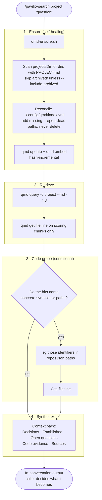

# pavilio-search: gather a project's accumulated context

## Why

Work on a project accumulates in five places: meeting notes (`notes/`), quick captures
(`memo/`), session records (`progress/`), designs and implementation plans (`plans/`),
and decisions (`DECISIONS.md`, `PROJECT.md`). By the time someone says "create a ticket
for this", the relevant context is spread across a dozen files written weeks apart, some
of which contradict each other.

Nothing currently retrieves across all of it.

- **`_index.json` covers `notes/` only, and incompletely** — metro has 33 indexed
  entries against 112 note files, and nothing at all from `memo/`, `progress/`,
  `plans/` or `DECISIONS.md`. Two active projects (`pavilio`, `workspace-setup`) have no
  `_index.json` at all, because they have no meeting notes — they are memo- and
  progress-only. `pavilio-question` reads this index, so it inherits the same blind spot.
- **QMD is wired correctly but rotting.** `~/.config/qmd/index.yml` points collections
  at `projects/projects/<name>` with `**/*.md`, which *would* cover everything. But the
  index was last updated 43–153 days ago, only 2 of 11 active projects have a collection
  (`alokai`, `metro`), and 3 collections point at paths that have since moved under
  `projects/archived/`.

So the material with the least retrieval coverage — discovery memos, progress notes,
decisions — is exactly the material a ticket needs.

## Approach

Lean on QMD, and make its freshness automatic rather than disciplinary.

QMD is a genuinely good fit once current: `qmd query` runs hybrid retrieval (BM25 +
vector + HyDE query expansion) then reranks. Asked *"why did both machines diverge and
what resolves generated file conflicts"* against a freshly-indexed collection, it
returned the correct progress note at 93%, with chunk-level line anchors — a note whose
text never uses the word "diverge" in that phrasing.

All three models are local, auto-downloaded from HuggingFace — `embeddinggemma-300M-Q8_0`
(embedding), `qwen3-reranker-0.6b-q8_0` (reranking), `Qwen3-0.6B-Q8_0` (generation). No
API key, no per-query cost, no network.

Measured on a 35-file project: BM25 index in **0.74s**, embedding 67 chunks in **5s**.
Both are hash-incremental, so re-running touches only changed files. Cold-indexing the
whole workspace (~900 files) is a one-off couple of minutes; every invocation after that
costs seconds.

That measurement is what makes the design safe. A stale semantic index is worse than no
index, because it fails by silently returning nothing — the same class of failure that
kept two machines out of sync for a day. Since refreshing is nearly free, the skill
refreshes on **every** invocation instead of trusting anyone to remember.

## Flow

## Components

### `qmd-ensure.sh` — index reconciliation

The only component that touches configuration or the index. Bundled beside `SKILL.md`
(the pattern `pavilio-grill` already uses for `ADR-FORMAT.md`).

**Discovery predicate:** every directory under `projectsDir` containing `PROJECT.md`, with
`archived/` excluded. Verified against the current workspace: all 11 active projects have
`PROJECT.md`, so the predicate needs no allowlist. It deliberately does *not* read
`.projects.local.md` — that file is gitignored, so a skill shipped upstream cannot depend
on it existing.

Archived projects are skipped by default because `CLAUDE.md` forbids scanning or indexing
them without asking. `--include-archived` opts in for a single invocation.

**Reconciliation is additive.** Missing collections are added
(`qmd collection add <dir> --name <project> --mask "**/*.md"`). Collections whose `path`
no longer exists are **reported, never removed** — today that is `ch`, `doterra` and
`openclaw`, whose notes moved under `projects/archived/`. Their indexed content is still
searchable, and silently dropping 264 indexed `ch` documents to tidy a config file is not
a trade the script gets to make on the user's behalf.

**Then `qmd update && qmd embed`.** Idempotent, safe on every invocation.

`--dry-run` prints the reconciliation plan and exits without touching anything.

### Retrieval

`qmd query "<question>" -c <project> --md -n 8`. With no project named, query each active
collection and label results by project.

Then `qmd get <file>:<line> -l <n>` to widen **only chunks that scored**. A folder is
never read wholesale — that is the failure mode this skill exists to avoid, and it is how
a context window gets burned on 283 markdown files.

### Code probe

Conditional. From the retrieved chunks, extract concrete identifiers: quoted or
backticked symbols, `path/like/this.ts`, PR and issue references. `rg` those inside the
repo paths from the project's `repos.json`, and cite `file:line`.

If the notes name nothing concrete, this stage is skipped entirely. Code is corroboration
for claims the notes actually make — it is not an independent search, and a ticket does
not benefit from source files nobody's notes mentioned. `gitara` has no `repos.json`; the
stage is skipped there too, without an error.

### Synthesis — the context pack

Emitted in conversation. Not written to a file: the caller decides whether it becomes a
ticket, a memo, or nothing, and a search that leaves artifacts behind on every run is a
search nobody runs twice.

| Section | Content |
| --- | --- |
| **Decisions** | Hits from `DECISIONS.md` and `PROJECT.md`. Listed first because they outrank narrative. |
| **What's established** | Each claim tagged `path · date`. |
| **Open questions & contradictions** | Where sources disagree, both are shown with their dates. |
| **Code evidence** | `file:line`, only where notes pointed. |
| **Sources** | Paths and dates, so the caller can go deeper. |

**Ordering rule:** a decision dated after a memo supersedes it. Recency and specificity
break ties. Where they conflict, the contradiction is surfaced rather than resolved
silently — for ticket-writing, "these two notes disagree, here are both dates" is more
useful than a confident wrong answer, and it is the one thing a human reviewer can act on
that the skill cannot.

## Boundaries

The script owns mechanics — config reconciliation, indexing, and nothing else. It is
testable standalone and has no opinion about queries. `SKILL.md` owns judgement —
retrieval strategy, ranking, what to widen, how to phrase a contradiction — and shells
out for the mechanical parts. Mechanics in bash, judgement in prose.

## Relationship to `pavilio-question`

Overlapping triggers, different jobs, and this design does not change `pavilio-question`.

- `pavilio-question` answers a question in prose from `_index.json` / `PROJECT.md`:
  "who is Alex", "what's the status of X".
- `pavilio-search` gathers a cited context pack across notes, memo, progress, plans,
  decisions and (conditionally) code, for downstream work like writing a ticket.

Both descriptions will state the division so the agent picks correctly.
`pavilio-question`'s notes-only retrieval is a real weakness — it cannot see `memo/`,
`progress/` or `plans/` at all — but rewiring it is separate work, deliberately not
bundled here.

## Testing

Skills are prose and not unit-tested. The testable unit is `qmd-ensure.sh`, run against a
temporary `HOME` and a synthetic `projectsDir`:

| Case | Expectation |
| --- | --- |
| Missing collection | added with the right path and `**/*.md` mask |
| Existing collection | left untouched, not duplicated |
| Collection with a dead path | reported, still present in `index.yml` |
| `archived/` present | skipped by default; included with `--include-archived` |
| Directory without `PROJECT.md` | not registered |
| `--dry-run` | prints the plan; `index.yml` byte-identical afterwards |

Plus one manual acceptance check: a query against a project whose collection did not
previously exist must return a correct hit, proving the ensure→query path works from cold.

## Consequences

Every invocation now depends on QMD being installed and its local models present. The
first run after a fresh checkout pays the cold-index cost, and the first ever run also
downloads the three models. Both are one-off and visible, not silent.

Search quality is bounded by what got written down. The skill surfaces gaps — a project
with no `DECISIONS.md` yields no decisions section — which is useful signal rather than a
defect to paper over.

## Home

`skills/pavilio-search/SKILL.md` plus `skills/pavilio-search/qmd-ensure.sh`, authored in
this repo (`gmotyl/pavilio`) and never committed consumer-first — `update.sh` rsyncs it
down, and anything landing in the consumer first is overwritten on the next sync.
Wrappers in `.claude/commands/` and `.opencode/commands/` are generated by
`scripts/setup:claude-code` and `scripts/setup:opencode`, and are gitignored — they are
never hand-authored.
