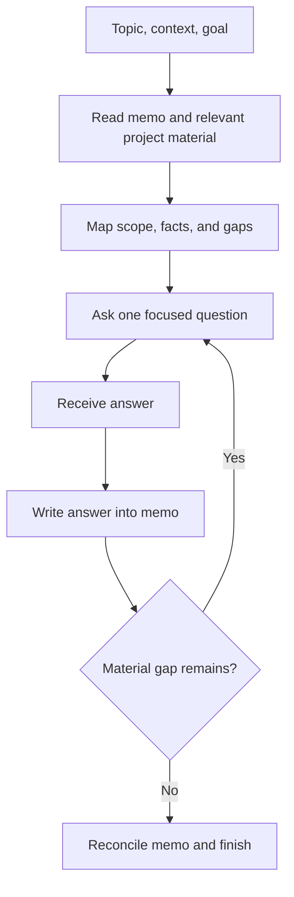
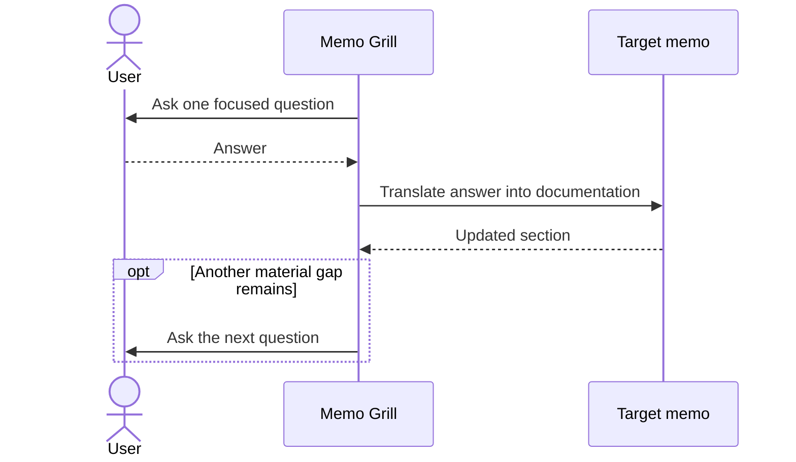

# Pavilio Memo Grill

Develop technical documentation through a focused interview. The memo is the working artifact: each answer becomes documentation before the next question.

## Usage

```text
/pavilio-memo-grill <topic/context> <documentation goal> [memo path]
```

## Behavior

1. **Establish the brief.** Require a topic/context and a documentation goal. Use the supplied memo path when present. If required information is missing, ask for one item only, then wait. Resolve a project or memo path from the workspace registry; never guess a path.
2. **Read before asking.** Read the target memo and relevant project `PROJECT.md` and `CONTEXT.md` files. Inspect up to three directly relevant supporting documents or source files. Use established terminology and facts; do not ask the user to repeat information already in the material.
3. **Frame the documentation.** Identify the audience, scope, key dimensions, confirmed facts, and material gaps. For a new section, create its heading and a concise framing statement in the target memo. For a new memo, follow [[pavilio-memo-explain]] naming and structure conventions.
4. **Grill one decision at a time.** Ask one concise, answerable question per message. Give a recommended answer and brief reason. Offer 2–3 choices only when there is a real fork; otherwise ask directly. After the question, stop and wait.
5. **Write each answer immediately.** When the user answers, translate it into polished documentation in the target memo. Preserve prior sections and unrelated edits. Do not leave a Q&A transcript or invent decisions. Then identify the next unresolved decision and ask it in the same reply, ending there. If no material gaps remain, perform the completion pass instead.
6. **Offer diagrams when useful.** Consider the topic's real dimensions: process or branching (`flowchart`), interaction order (`sequenceDiagram`), lifecycle (`stateDiagram-v2`), data relationships (`erDiagram`), or system boundaries (`C4`). When a diagram would clarify the material, ask in a separate turn whether the user wants it, with a recommendation and reason. Wait for the answer; add only diagrams the user accepts. Follow [[pavilio-mermaid-chart]].
7. **Complete the document.** Reconcile the accumulated answers, remove temporary placeholders, check terminology and internal consistency, and ensure each diagram matches the text. Stop when the stated documentation goal is met; leave a clearly identified open item only if the user chose to defer it.





## Non-goals

- Does not create OpenSpec changes, implementation plans, code, or tests.
- Does not rewrite unrelated memo sections or silently resolve unanswered decisions.
- Does not add a diagram without first asking when a meaningful chart opportunity exists.
