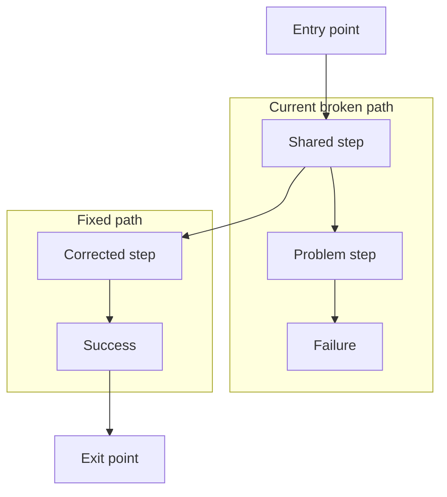
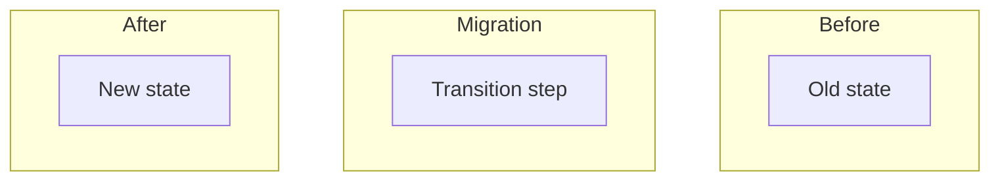
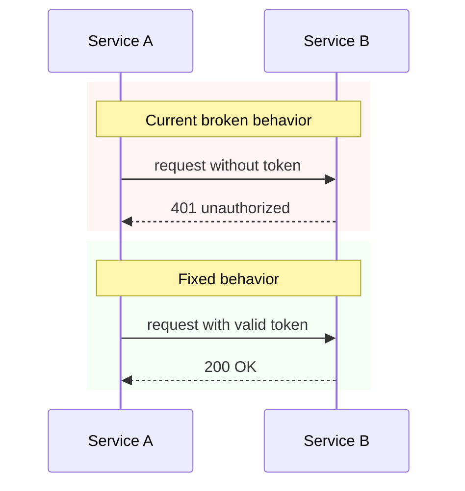

# Mermaid Chart Guide for Design Docs

The panel renders mermaid diagrams with automatic dark-mode coloring. To get the best visual output, follow these patterns.

## How the panel colors diagrams

### Flowcharts

- **Subgraph clusters** get distinct colors by order: 1st = cyan, 2nd = red, 3rd = green, 4th = blue, 5th = purple, 6th = yellow (cycles)
- **Nodes inside a subgraph** inherit the subgraph's color (darker fill, matching border)
- **Nodes outside subgraphs** get a neutral teal color
- Use subgraphs to visually group related steps — the panel colors them automatically

### Sequence Diagrams

- **`rect` sections** get distinct colors by vertical order: 1st = red, 2nd = green, 3rd = blue, 4th = purple (cycles)
- **Actors** each get a unique color from an 8-color palette (amber, green, blue, cyan, violet, pink, emerald, yellow)
- **Lifelines and activation bars** match their actor's color
- **Solid arrows** (`->>`) render in blue — use for synchronous calls/requests
- **Dotted arrows** (`-->>`) render in amber — use for async responses/returns
- **Notes** render in dark teal

## Flowchart patterns

### Use subgraphs for before/after or current/fixed

Put the problematic flow in the first subgraph and the fixed flow in the second. The panel will color the first red and the second green automatically:

````markdown

````

### Root nodes for entry/exit points

Keep shared entry and exit nodes outside subgraphs so they get the neutral teal color, visually separating them from the grouped paths.

### Node labels

- Use `\n` for line breaks in labels: `A[First line\nSecond line]`
- Avoid starting label text with `/` — mermaid interprets `[/text]` as a parallelogram shape. The panel auto-fixes this, but it's cleaner to avoid it
- Keep labels concise — long text overflows node boundaries

### Three-way comparisons

For before/during/after patterns, use three subgraphs:

````markdown

````

Colors: Before = cyan, Migration = red, After = green.

## Sequence diagram patterns

### Use `rect` blocks for current/fixed sections

The `rect` color values in the markdown source are ignored by the dark theme — the panel overrides them. But include them for GitHub/other renderers:

````markdown

````

First `rect` = red tint (broken/current), second `rect` = green tint (fixed).

### Arrow conventions

| Syntax | Meaning | Panel color |
|--------|---------|-------------|
| `A->>B: text` | Synchronous call | Blue (solid) |
| `A-->>B: text` | Async response/return | Amber (dotted) |
| `A->>+B: text` | Call with activation | Blue + activation bar |
| `B-->>-A: text` | Return with deactivation | Amber |

### Notes for section labels

Use `Note over` spanning all participants to create section headers:

```
Note over A,Z: Section title
```

### `alt`/`opt`/`loop` blocks

Use for conditional logic within a section. These render as smaller outlined boxes inside the section rect:

```
alt condition text
    A->>B: path 1
else other condition
    A->>C: path 2
end
```

## When to use which diagram

| Scenario | Diagram type |
|----------|-------------|
| Step-by-step process, branching logic, state transitions | Flowchart (`flowchart TD`) |
| Multi-service interaction, request/response ordering, timing | Sequence diagram (`sequenceDiagram`) |
| Both needed | Include both — flowchart for the high-level flow, sequence for the interaction detail |

## Checklist for design docs

- [ ] Multi-step flow? Add a `flowchart TD` with subgraphs for current vs fixed
- [ ] Cross-system interaction? Add a `sequenceDiagram` with `rect` sections
- [ ] Subgraphs ordered: broken/current first, fixed/new second
- [ ] Entry and exit nodes outside subgraphs
- [ ] Solid arrows for calls, dotted for responses
- [ ] `Note over` for section labels in sequence diagrams
- [ ] Labels concise, `\n` for line breaks
