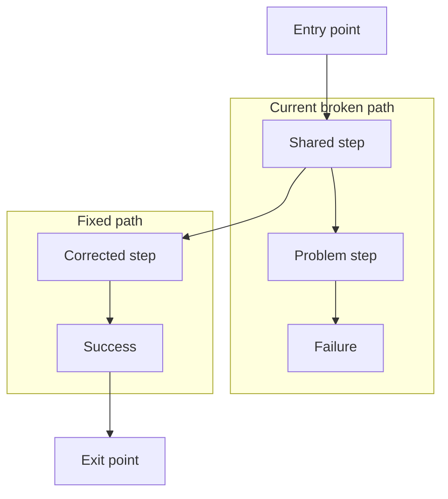
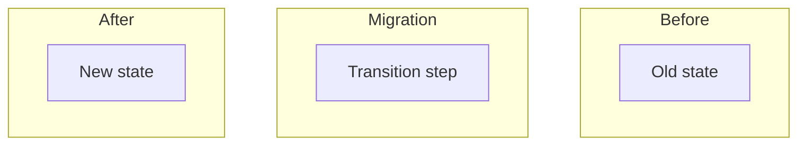
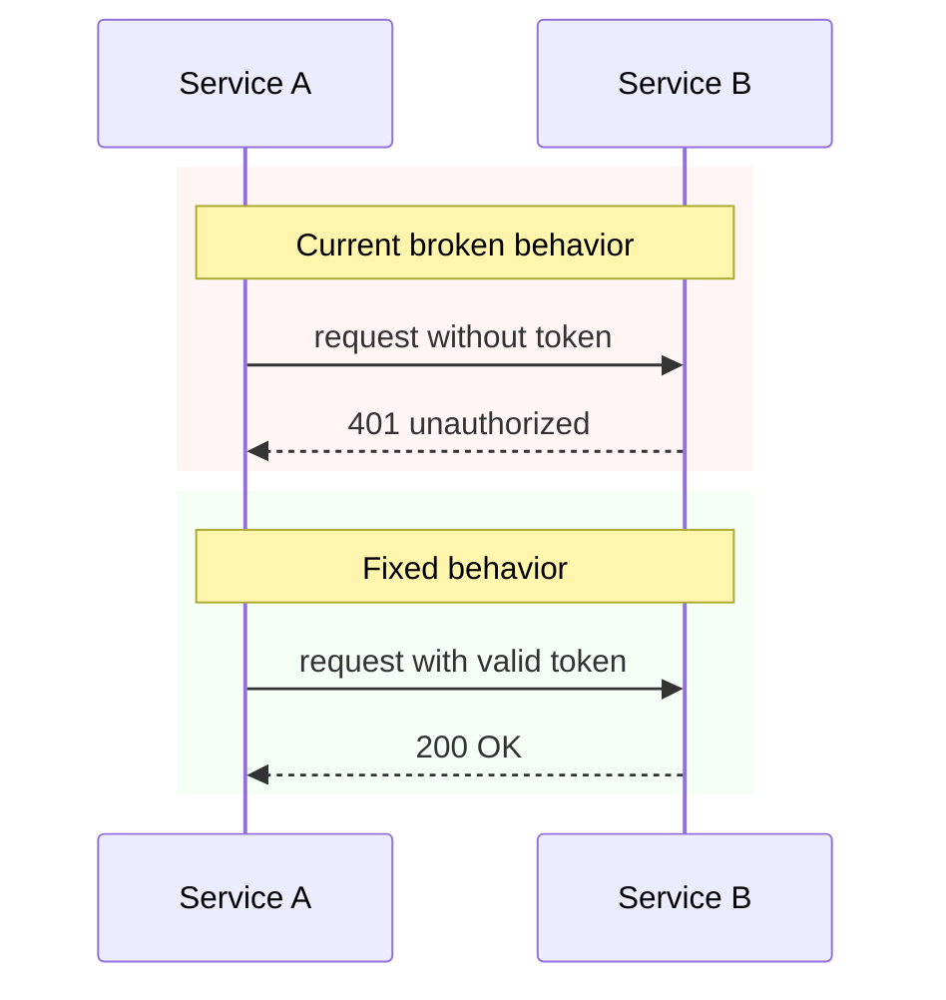
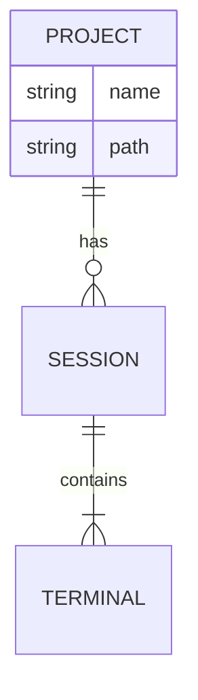
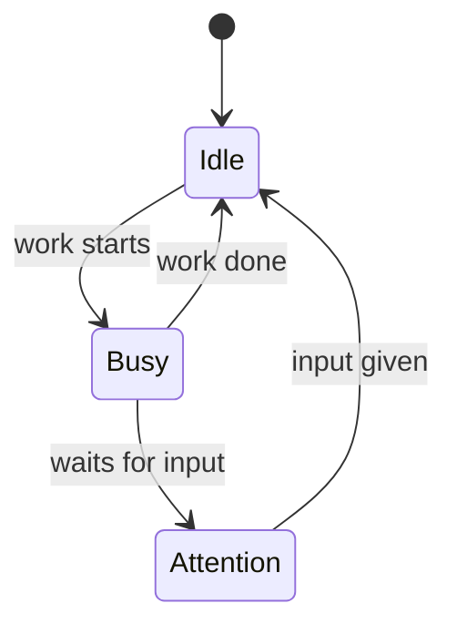
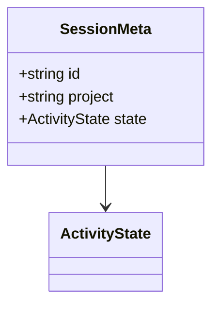
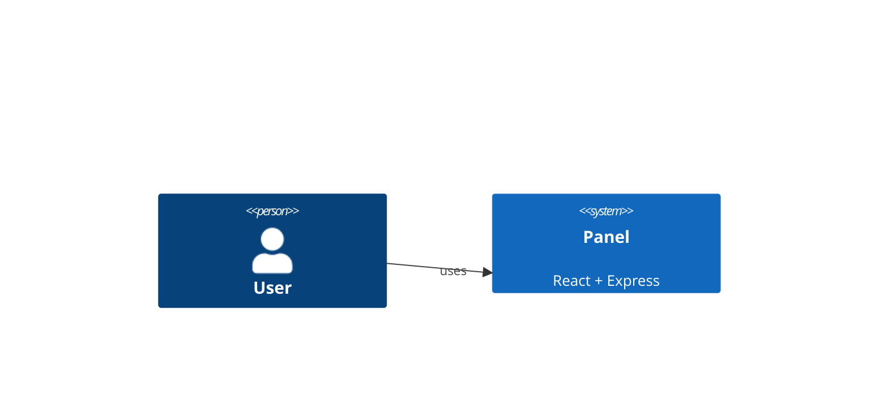
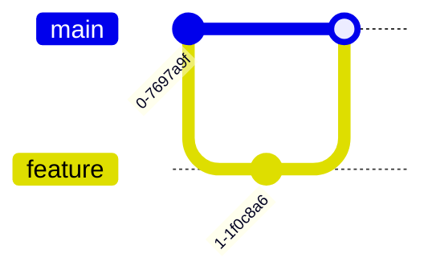
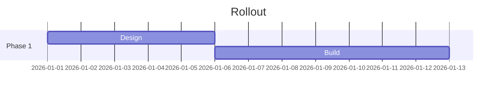
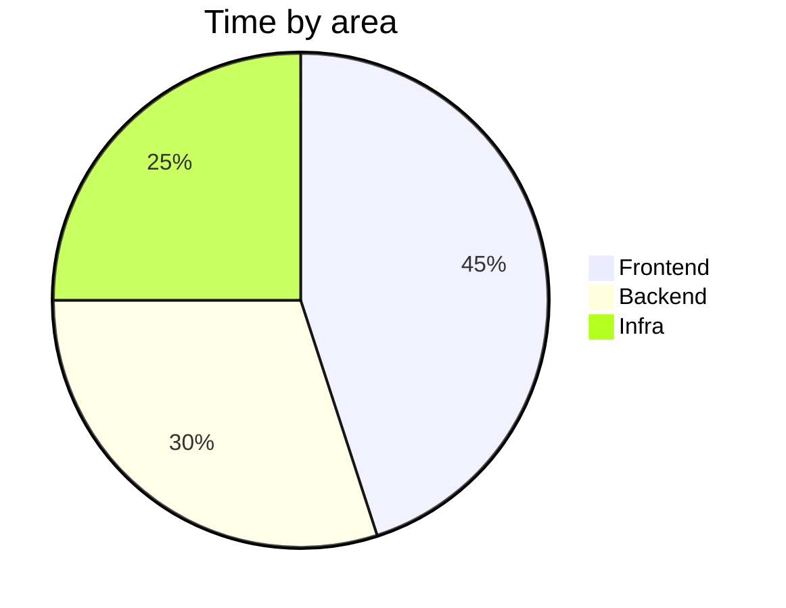

# Mermaid Chart Guide for Design Docs

The panel renders mermaid diagrams with automatic dark-mode coloring. To get the best visual output, follow these patterns.

## How the panel colors diagrams

### Flowcharts

- **Subgraph clusters** get distinct colors by order: 1st = cyan, 2nd = red, 3rd = green, 4th = blue, 5th = purple, 6th = yellow (cycles)
- **Nodes inside a subgraph** inherit the subgraph's color (darker fill, matching border)
- **Nodes outside subgraphs** get a neutral teal color
- Use subgraphs to visually group related steps — the panel colors them automatically

### Sequence Diagrams

- **`rect` sections** get distinct colors by vertical order: 1st = red, 2nd = green, 3rd = blue, 4th = purple (cycles)
- **Actors** each get a unique color from an 8-color palette (amber, green, blue, cyan, violet, pink, emerald, yellow), in order of first appearance
- **Lifelines and activation bars** match their actor's color
- **Message arrows are colored by the sending actor** — a solid call (`->>`) takes the source actor's color; a dotted response (`-->>`) takes a brightened tint of that same color. So every message a given actor sends shares its hue; there is no fixed blue/amber.
- **Notes** render in dark teal

> The palette rotation above (flowchart clusters, sequence sections/actors) is applied **only to flowcharts and sequence diagrams**. Every other diagram type gets the shared dark base theme instead — see [Other diagram types](#other-diagram-types-erd-c4-state-git-graph-gantt-pie-class).

## Flowchart patterns

### Use subgraphs for before/after or current/fixed

Put the problematic flow in the first subgraph and the fixed flow in the second. The panel will color the first red and the second green automatically:

````markdown

````

### Root nodes for entry/exit points

Keep shared entry and exit nodes outside subgraphs so they get the neutral teal color, visually separating them from the grouped paths.

### Node labels

- Use `\n` for line breaks in labels: `A[First line\nSecond line]`
- Avoid starting label text with `/` — mermaid interprets `[/text]` as a parallelogram shape. The panel auto-fixes this, but it's cleaner to avoid it
- Keep labels concise — long text overflows node boundaries

### Three-way comparisons

For before/during/after patterns, use three subgraphs:

````markdown

````

Colors: Before = cyan, Migration = red, After = green.

## Sequence diagram patterns

### Use `rect` blocks for current/fixed sections

The `rect` color values in the markdown source are ignored by the dark theme — the panel overrides them. But include them for GitHub/other renderers:

````markdown

````

First `rect` = red tint (broken/current), second `rect` = green tint (fixed).

### Arrow conventions

| Syntax | Meaning | Panel color |
|--------|---------|-------------|
| `A->>B: text` | Synchronous call | Solid, in A's actor color |
| `A-->>B: text` | Async response/return | Dotted, brightened A's actor color |
| `A->>+B: text` | Call with activation | A's color + activation bar in target's color |
| `B-->>-A: text` | Return with deactivation | Dotted, brightened B's color |

Arrows inherit the **sending** actor's hue, so keep calls (`->>`) and responses (`-->>`) semantically correct and the coloring follows automatically.

### Notes for section labels

Use `Note over` spanning all participants to create section headers:

```
Note over A,Z: Section title
```

### `alt`/`opt`/`loop` blocks

Use for conditional logic within a section. These render as smaller outlined boxes inside the section rect:

```
alt condition text
    A->>B: path 1
else other condition
    A->>C: path 2
end
```

## Other diagram types (ERD, C4, state, git graph, gantt, pie, class)

Flowcharts and sequence diagrams are the two types with bespoke panel coloring. The types below are fully supported and render cleanly, but they do **not** get the per-group/per-entity palette rotation. Instead the panel applies a shared dark base theme plus three global normalizations to every diagram:

- all text → light grey `#e4e4e7`
- all plain lines → grey `#52525b`
- default/black arrows → blue `#3b82f6`; boxes and nodes → dark teal `#1a3a3a` with a teal border

**Consequence:** don't lean on color to distinguish groups in these types — everything is one palette. If a concept genuinely needs colored grouping (current vs proposed, frontend vs backend), model it as a `flowchart` with subgraphs instead. Use the types below for what they express structurally.

### Entity-relationship (`erDiagram`) — data models & DB schemas

````markdown

````

### State (`stateDiagram-v2`) — lifecycles & state machines

````markdown

````

### Class (`classDiagram`) — domain models & type relationships

````markdown

````

### C4 (`C4Context` / `C4Container`) — system architecture at a level

C4 support is experimental in mermaid; stick to `C4Context` and `C4Container` and keep it small.

````markdown

````

### Git graph (`gitGraph`) — branching & release flow

````markdown

````

### Gantt (`gantt`) — timelines & rollout phases

````markdown

````

### Pie (`pie`) — proportional breakdown

````markdown

````

## When to use which diagram

| Scenario | Diagram type |
|----------|-------------|
| Step-by-step process, branching logic, decision trees | Flowchart (`flowchart TD`) |
| Multi-service interaction, request/response ordering, timing | Sequence diagram (`sequenceDiagram`) |
| Object lifecycle, status transitions, state machine | State (`stateDiagram-v2`) |
| Database schema, entities and their relationships | ERD (`erDiagram`) |
| Domain model, classes/types and their associations | Class (`classDiagram`) |
| System / container architecture, who talks to what | C4 (`C4Context` / `C4Container`) |
| Branching strategy, release/merge flow | Git graph (`gitGraph`) |
| Project timeline, phased schedule | Gantt (`gantt`) |
| Proportional split of a whole | Pie (`pie`) |
| Both structural and temporal | Include both — flowchart for high-level flow, sequence for the interaction detail |

## Checklist for design docs

- [ ] Diagram type matches the concept (see the table above) — not always a flowchart
- [ ] Need colored grouping? Use a `flowchart`/`sequenceDiagram` — other types are single-palette
- [ ] Multi-step flow? Add a `flowchart TD` with subgraphs for current vs fixed
- [ ] Cross-system interaction? Add a `sequenceDiagram` with `rect` sections
- [ ] Subgraphs ordered: broken/current first, fixed/new second
- [ ] Entry and exit nodes outside subgraphs
- [ ] Solid arrows (`->>`) for calls, dotted (`-->>`) for responses — color follows the sending actor
- [ ] `Note over` for section labels in sequence diagrams
- [ ] Labels concise, `\n` for line breaks
